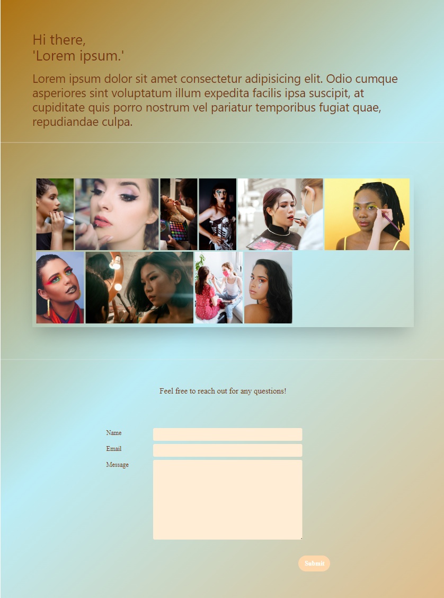
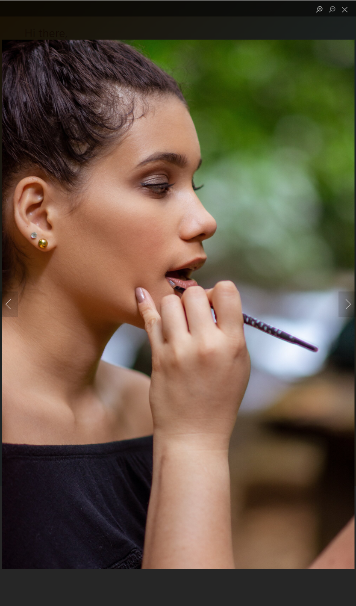

# MAKE-UP PORTFOLIO

The purpose of this project was to create a portfolio to promote the work of a Make-Up Artist.
My objectif here was to use what I have learned so far during the course "Web Developer from Zero to Mastery" using CSS, JavaScript and React.

## Tech Stack

**Front-End:** React, tailwindcss

## Screenshots

## Available Scripts

In the project directory, you can run:

### `npm start`

Runs the app in the development mode.\
Open [http://localhost:3000](http://localhost:3000) to view it in your browser.

